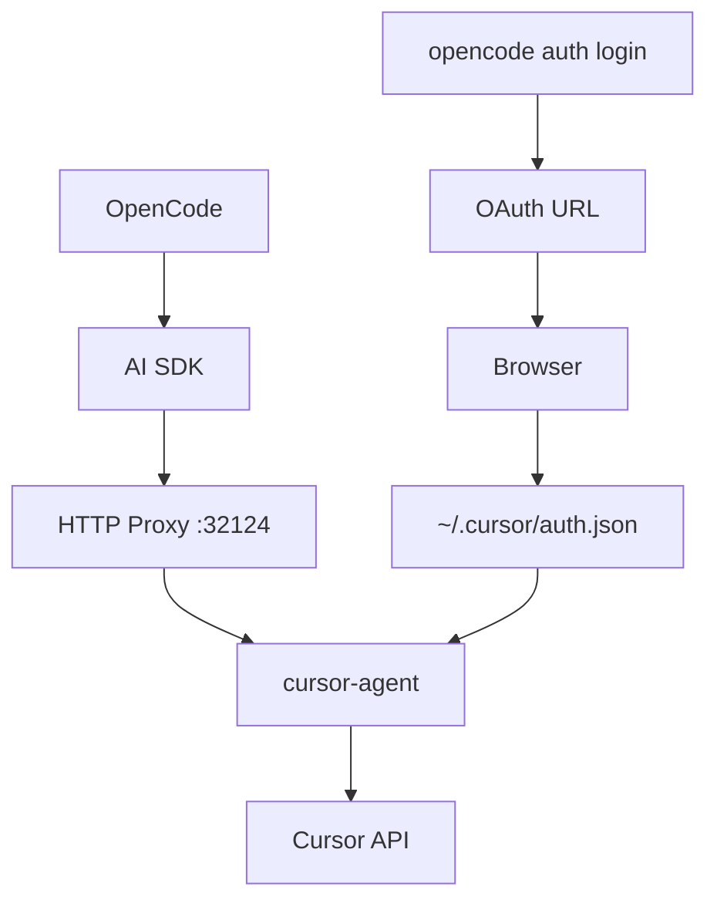

Use your Cursor Pro subscription in [OpenCode](https://github.com/anomalyco/opencode). HTTP proxy to cursor-agent with OAuth support.

## Installation

**One-Line Install:**

```bash
curl -fsSL https://raw.githubusercontent.com/Nomadcxx/opencode-cursor/main/install.sh | bash
```

**TUI Installer:**

```bash
git clone https://github.com/Nomadcxx/opencode-cursor.git
cd opencode-cursor
./cmd/installer/installer-binary
```

**Manual Install:**

```bash
bun install && bun run build
ln -s $(pwd)/dist/index.js ~/.config/opencode/plugin/cursor-acp.js
```

Add to `~/.config/opencode/opencode.json`:

```json
{
  "plugin": ["cursor-acp"],
  "provider": {
    "cursor-acp": {
      "name": "Cursor",
      "npm": "@ai-sdk/openai-compatible",
      "options": { "baseURL": "http://127.0.0.1:32124/v1" },
      "models": {
        "auto": { "name": "Auto" },
        "sonnet-4.5": { "name": "Claude Sonnet 4.5" },
        "gpt-5.2": { "name": "GPT-5.2" }
      }
    }
  }
}
```

## Authentication

```bash
# Option 1: Via OpenCode
opencode auth login
# Select "Other" → enter "cursor-acp" → open URL in browser

# Option 2: Direct
cursor-agent login
```

## Usage

```bash
opencode run "your prompt" --model cursor-acp/auto
opencode run "your prompt" --model cursor-acp/sonnet-4.5
```

## Models

Available via `cursor-agent --list-models`:

| Model | Description |
|-------|-------------|
| `auto` | Auto-select |
| `sonnet-4.5` | Claude Sonnet 4.5 |
| `opus-4.5` | Claude Opus 4.5 |
| `opus-4.5-thinking` | Claude Opus 4.5 (thinking) |
| `sonnet-4.5-thinking` | Claude Sonnet 4.5 (thinking) |
| `gpt-5.2` | GPT-5.2 |
| `gpt-5.2-high` | GPT-5.2 High |
| `gpt-5.2-codex` | GPT-5.2 Codex |
| `gemini-3-pro` | Gemini 3 Pro |
| `gemini-3-flash` | Gemini 3 Flash |
| `grok` | Grok |
| `composer-1` | Cursor Composer |

## Architecture



## Alternatives

| Feature | cursor-acp | cursor-agent CLI | Cursor IDE |
|---------|------------|------------------|------------|
| OpenCode Integration | Native | Manual | No |
| Long Prompts | HTTP proxy | CLI limits | No limits |
| Terminal | Yes | Yes | GUI only |
| Auth | OAuth | OAuth | Built-in |

## Prerequisites

- [Bun](https://bun.sh/)
- [cursor-agent](https://cursor.com/) - `curl -fsSL https://cursor.com/install | bash`

## Features

- HTTP proxy (avoids E2BIG errors)
- Streaming responses
- OAuth authentication
- Error parsing (quota/auth/network)

## Troubleshooting

**"fetch() URL is invalid"** - Run `opencode auth login` without arguments

**Model not responding** - Run `cursor-agent login` to re-authenticate

**Quota exceeded** - Check [cursor.com/settings](https://cursor.com/settings)

## License

BSD-3-Clause
